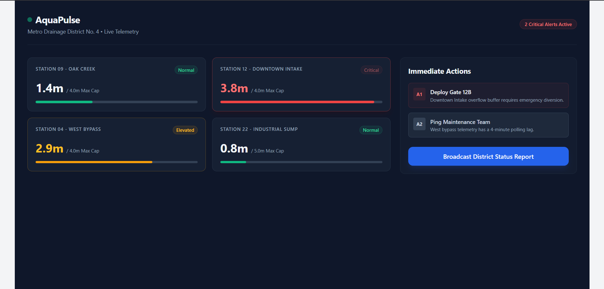

Tailwind CSS Practice Project 

This project was created to learn and practice Tailwind CSS using the CLI setup with Vite.

We built:
Tailwind environment setup
Dashboard UI practice
Responsive layouts
Grid & Flexbox concepts
Modern UI styling

Environment Setup:
1. Initialize npm 
npm init -y

Creates:
package.json

2. Install Vite
npm install vite

Vite is used for:
faster development server
live reload
modern frontend workflow

3. Install Tailwind CSS
npm install -D tailwindcss postcss autoprefixer

4. Generate Config Files
npx tailwindcss init -p

Creates:
tailwind.config.js
postcss.config.js

5. Configure Tailwind Content
Inside:

tailwind.config.js

Add:

/** @type {import('tailwindcss').Config} */
module.exports = {
  content: ["./**/*.{html,js}"],
  theme: {
    extend: {},
  },
  plugins: [],
}

This tells Tailwind to scan:

HTML files
JS files

for utility classes.

6. Create Tailwind Input CSS
Create:

style.css

Add:

@tailwind base;
@tailwind components;
@tailwind utilities;

These are Tailwind directives.

7. Build Tailwind Output CSS

Run:

npx tailwindcss -i ./style.css -o ./output.css --watch

Explanation:
Command Part	Meaning
-i	input file
style.css	Tailwind source
-o	output file
output.css	generated CSS
--watch	auto rebuild on changes

8. Link CSS with HTML
Inside HTML <head>:

<link rel="stylesheet" href="output.css">
9. Add Vite Script

Inside:

package.json

Add:

"scripts": {
  "dev": "vite"
}

10. Start Development Server
npm run dev
